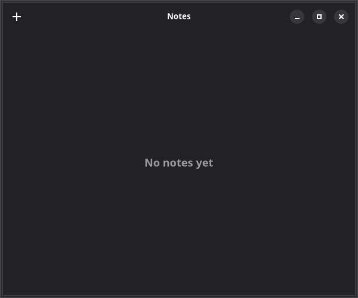

# 1. Window & Header Bar

In this tutorial, you'll build a fully-featured Notes application from scratch. Each chapter introduces new GTKX concepts by adding functionality to the app. By the end, you'll have a polished, deployable desktop application.



## Create the Project

Start by scaffolding a new project:

```bash
npx @gtkx/cli@latest create notes-app
```

Choose your preferred package manager and enable testing when prompted.

## The Application Window

Replace the generated `src/app.tsx` with an Adwaita-styled window:

```tsx
import { AdwApplicationWindow, AdwHeaderBar, AdwToolbarView, GtkBox, GtkLabel, quit } from "@gtkx/react";
import * as Gtk from "@gtkx/ffi/gtk";

export default function App() {
    return (
        <AdwApplicationWindow title="Notes" defaultWidth={600} defaultHeight={500} onClose={quit}>
            <AdwToolbarView>
                <AdwToolbarView.AddTopBar>
                    <AdwHeaderBar />
                </AdwToolbarView.AddTopBar>
                <GtkBox
                    orientation={Gtk.Orientation.VERTICAL}
                    spacing={12}
                    marginTop={24}
                    marginStart={24}
                    marginEnd={24}
                    vexpand
                    halign={Gtk.Align.CENTER}
                    valign={Gtk.Align.CENTER}
                >
                    <GtkLabel label="No notes yet" cssClasses={["dim-label", "title-3"]} />
                </GtkBox>
            </AdwToolbarView>
        </AdwApplicationWindow>
    );
}
```

### Compound Components

Notice `<AdwToolbarView.AddTopBar>` — this is a **compound component**. Instead of imperatively calling `toolbar.addTopBar(headerBar)`, you declare the relationship in JSX. Compound components are auto-generated from GIR metadata and follow the pattern `ParentWidget.SlotName`.

Common compound components you'll see throughout this tutorial:

| Component | Purpose |
|-----------|---------|
| `AdwToolbarView.AddTopBar` | Add a widget to the top bar area |
| `AdwToolbarView.AddBottomBar` | Add a widget to the bottom bar area |
| `GtkHeaderBar.PackStart` | Pack a widget at the start of a header bar |
| `GtkHeaderBar.PackEnd` | Pack a widget at the end of a header bar |

### Slot Props

Some widgets accept a single child in a named position. These are expressed as **slot props** — JSX props that accept a React element:

```tsx
<AdwHeaderBar titleWidget={<GtkLabel label="Notes" cssClasses={["heading"]} />} />
```

The `titleWidget` prop replaces the default title text with a custom widget. Other common slot props include `popover`, `startChild`, `endChild`, and `content`.

## Adding Header Bar Buttons

Add a "New Note" button to the header bar:

```tsx
import {
    AdwApplicationWindow,
    AdwHeaderBar,
    AdwToolbarView,
    GtkBox,
    GtkButton,
    GtkLabel,
    quit,
} from "@gtkx/react";
import * as Gtk from "@gtkx/ffi/gtk";

export default function App() {
    return (
        <AdwApplicationWindow title="Notes" defaultWidth={600} defaultHeight={500} onClose={quit}>
            <AdwToolbarView>
                <AdwToolbarView.AddTopBar>
                    <AdwHeaderBar>
                        <AdwHeaderBar.PackStart>
                            <GtkButton
                                iconName="list-add-symbolic"
                                onClicked={() => console.log("New note!")}
                            />
                        </AdwHeaderBar.PackStart>
                    </AdwHeaderBar>
                </AdwToolbarView.AddTopBar>
                <GtkBox
                    orientation={Gtk.Orientation.VERTICAL}
                    spacing={12}
                    vexpand
                    halign={Gtk.Align.CENTER}
                    valign={Gtk.Align.CENTER}
                >
                    <GtkLabel label="No notes yet" cssClasses={["dim-label", "title-3"]} />
                </GtkBox>
            </AdwToolbarView>
        </AdwApplicationWindow>
    );
}
```

Run `npm run dev` to see your app with a header bar and a "+" button.

## Next

In the [next chapter](./2-styling.md), you'll style the notes list with CSS-in-JS.
